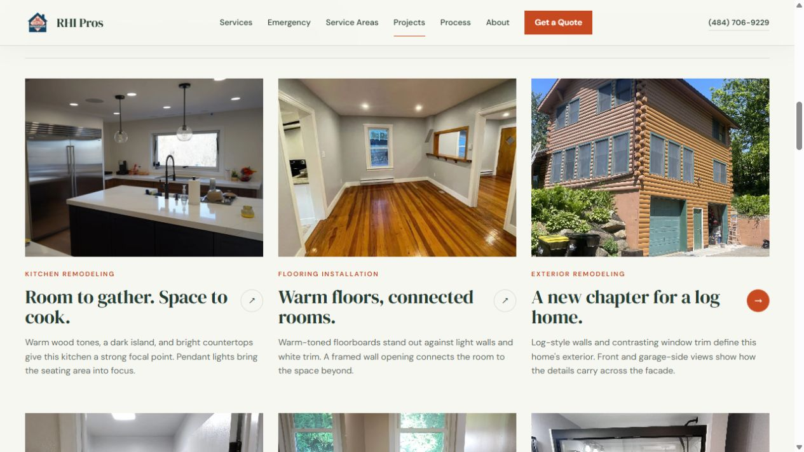
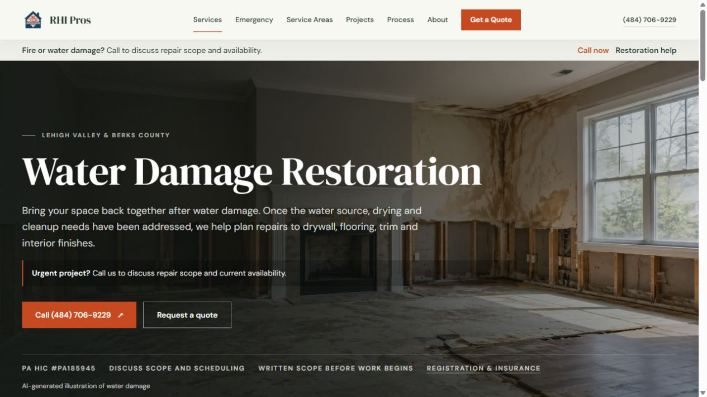
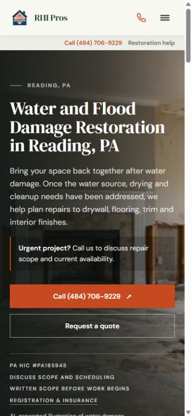

# Customer copy and image completeness — 2026-09-30

The kitchen card's “Two kitchens. Separate photo groups.” headline described an internal editorial decision instead of helping a customer picture their home. The water service also still lacked imagery. This pass corrects both and checks actual image delivery on the local production build.

## Improvements

- The kitchen card now reads **“Room to gather. Space to cook.”** Its description focuses on warm wood, the dark island, bright counters and pendant lights. The detail headings are **“Island seating & contrasting cabinets”** and **“White cabinetry & open-plan living.”** Different rooms remain clearly distinguished without audit language.
- All 24 public detail descriptions and photo-related local planning copy now describe rooms, layouts, materials and finishes. Photo memberships, original bytes, before/after decisions, withheld historical claims and URLs are preserved.
- Replaced public audit wording with “Take a closer look,” “Design & finish ideas,” “Bathroom details, up close” and “Open framing & damaged spaces.” Internal reasoning stays in the evidence reports; useful notices for illustrative planning and generated imagery remain.
- The Services explorer's unsupported “Real homes. Our work.” badge now says “Ideas for your space.”
- Removed unrelated renovation boilerplate from fallback fire/water location heroes and shortened the water introduction. Sample scopes remain clearly identified as examples; insurance-role boundaries remain intact.
- Added the new generic water-damage interior image to the homepage water card, main water service hero and all six local water service heroes. Each placement labels it as an AI-generated illustration; alt text does too. It never appears as a completed project or before/after image.
- Added the omitted Wyomissing hero-map entry with existing general interior imagery, without claiming a photographed Wyomissing job.
- Added three coherent winter-exterior condition photos under “Damage & repair details” on main/local fire pages, with working Photos jump links. They show conditions relevant to reconstruction, not a completed rebuild.
- Intentional text-only insurance/planning introductions no longer have decorative photo placeholders or unnecessary full photo-hero minimum heights. The water planning record stays outside the completed-photo showcase.

## Verification

The new command is `npm run check:images -- http://127.0.0.1:3108`. It validates source references, fully decodes raster pixels, crawls the sitemap/landing/filter views, checks required imagery and alt attributes, validates water illustration labels, and fetches distinct local image responses including Next's optimized URLs. It also guards against the specific confusing audit wording. It only targets localhost; it does not fetch tracking pixels or authenticated remote portfolio data.

| Final check                       | Result                                                                           |
| --------------------------------- | -------------------------------------------------------------------------------- |
| Page views crawled                | 126                                                                              |
| Distinct literal image references | 192, all resolve                                                                 |
| Raster images fully decoded       | 192, no corrupt files                                                            |
| Local rendered image URLs fetched | 112, all valid image responses                                                   |
| Image/copy-guard errors           | 0                                                                                |
| Rendered SEO crawl                | 115 routes, 24 project routes, 115 internal targets; 0 errors                    |
| Evidence tests                    | 6 passed; all 103 original project assets and 106 per-record references retained |
| Formatting, lint, typecheck       | Passed                                                                           |
| Production build                  | Passed; 124 generated pages                                                      |
| Static SEO checker                | 0 errors; 1 intentional text-only water-planning warning                         |

Results: [image audit](image-delivery-2026-09-30.json), [rendered SEO audit](rendered-customer-polish-2026-09-30.json).

Browser review on the final build confirmed the revised desktop kitchen card, loaded water image at desktop and 390px mobile sizes, illustration labeling and the loaded Wyomissing hero. Checked widths had no horizontal overflow: 1265px document within the 1280px desktop viewport and 375px within the 390px mobile viewport. The mobile restoration page no longer contains the unrelated Reading renovation paragraph. Temporary viewport settings were reset.

The audit covers all local raster files and these rendered page states. Alternative interactive Services explorer images are covered by source checks and full decoding; the entire interaction matrix was not clicked again. Authenticated remote feeds, real lead delivery and live deployment remain outside this local verification. No publish, commit, external message or valid lead submission was performed.

## Generated asset

Built-in image-generation tool used, with no fallback API or CLI. Website asset: [water-damage-interior.png](../../public/images/service-illustrations/water-damage-interior.png), 1672×941. The original generated output remains in the Codex image folder; the website uses the repository copy.

The original `/mnt/data/wide_angle_interior_photo_of_a_partially_renovated.png` remains unavailable here. This asset is a newly generated replacement, not a claimed retrieval of that file.

Final generation prompt:

> Use case: photorealistic-natural. Asset type: generic water-damage restoration service hero for a remodeling website, a wide landscape interior photograph. Create an unbranded, realistically photographed residential living room midway through preparation for water-damage repairs: lower sections of drywall selectively removed around the room, exposed wooden studs, visibly water-stained upper drywall near one corner, bare subfloor and a small remaining section of lifted damaged flooring, daylight through a window. Camera at normal eye height with a natural wide-angle lens; straight architecture, credible construction details, restrained neutral colors. Keep the left half relatively simple and darker to support white website text, with clearer repair details and daylight on the right. This is a generic illustrative scene, not an actual contractor job or a case study. No people, company marks, signs, logos, text, watermark, before/after split, fire damage, excessive flooding, or claims of completed work. Landscape 16:9 composition.

## Files changed

- `CODEX.md`; `package.json`; `scripts/check-site-images.mjs` (new); `scripts/check-rendered-seo.mjs`
- `src/content/services.ts`; `projectEvidence.ts`; `projectShowcase.ts`; `localSeo.ts`
- `src/components/sections/ServiceHero.tsx`; `ProjectCard.tsx`; `ServiceExplorer.tsx`
- `src/app/page.tsx`; `src/app/[city]/page.tsx`; `src/app/[city]/[service]/page.tsx`; `src/app/services/[service]/page.tsx`
- `src/app/projects/page.tsx`; `src/app/projects/[slug]/page.tsx`; `src/app/services/whole-home-remodeling/page.tsx`
- `src/app/landing/bathroom-remodeling/page.tsx`; `src/app/berks-county-pa/kitchen-cabinet-installation/page.tsx`
- `public/images/service-illustrations/water-damage-interior.png` (new)
- This report, the two audit JSONs, three preview PNGs below and an update to the earlier evidence-resolution report.

## Previews

