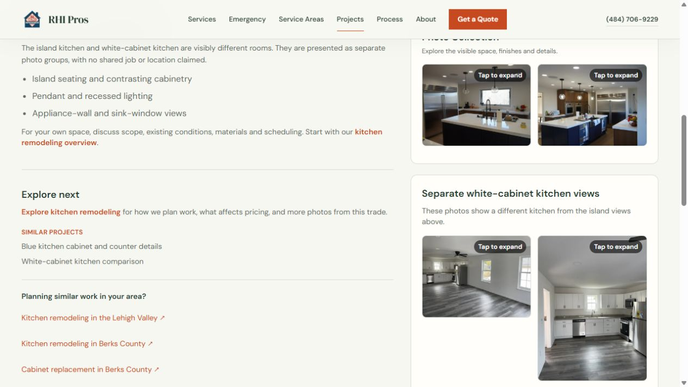
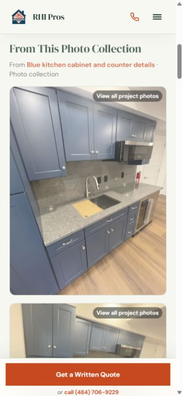
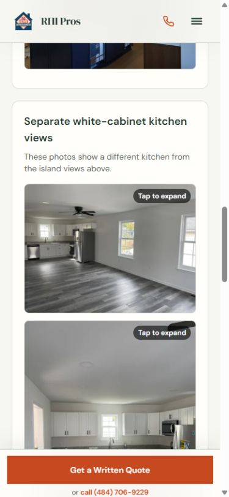
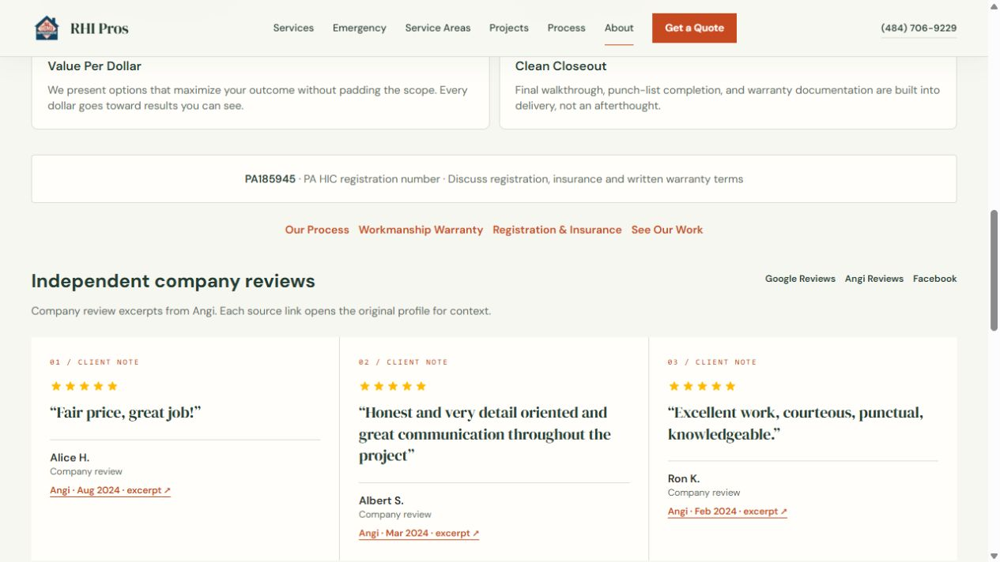
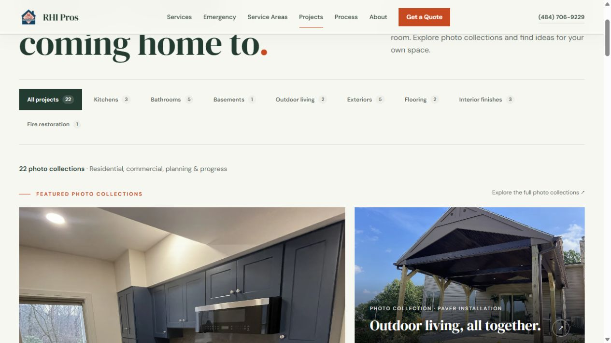

# Evidence resolution and release checks — 2026-09-30

The owner-verification investigation is complete to the extent the available evidence permits. Public review sources, repository history, original photo matches, all supplied project media, ingestion scripts and selected image metadata were checked. Unknown job facts were not guessed. The resulting site publishes observable photo details, source-linked company review excerpts and useful planning information instead of unsupported customer/job associations or operating assurances.

This report supersedes the unresolved publishing decisions in the earlier [trust cleanup](trust-cleanup-2026-09-30.md) and [site quality pass](site-quality-pass-2026-09-30.md). Those reports remain historical records. Changes are local; no commit, push, deployment, valid lead submission or external data mutation was performed.

## Automatic fixes

Subsequent update: the [customer-copy and image pass](customer-polish-2026-09-30.md) simplifies public gallery wording, adds the missing water/Wyomissing imagery, adds fire condition galleries and verifies actual image delivery. Internal evidence findings below remain valid; the later report records current customer-facing wording and visuals.

- All 24 existing project URLs remain. Shared public exports now apply reviewed evidence overrides; a new unchecked record cannot silently enter the public set. Original historical records remain privately preserved for traceability.
- Unsupported towns, build durations, hidden construction stories, results and 11 project/customer quote associations are withheld from all public project records. Pages are labeled photo collections, comparison boards or planning references. Local planning links remain separate from photo provenance.
- All 103 distinct original photo assets, comprising 106 per-record unique references, are retained on their respective existing detail routes. SHA-256 checks confirm original bytes are unchanged.
- The mixed kitchen page has two island-kitchen views and a separately labeled two-photo white-cabinet group. It is no longer featured as one completed Allentown job. A coherent blue-cabinet collection leads the Projects page, alongside the patio/pavilion and media-room collections.
- The repeated exterior detail keeps its URL and photos, links to the shared primary overview and is omitted from the showcase grid. This does not declare that separate contracts were merged.
- The fireplace photos describe the visible surround/hearth and use the interior-finish category. They are no longer promoted as proof of a fire-loss rebuild. Fire service imagery instead shows supplied visibly damaged exterior conditions, without asserting location, RHI authorship or completion.
- The field documentation preserves all 38 photos in three labeled visual groups. No shared property, construction chronology or finished reconstruction is claimed. The ingestion folder named `after` is not treated as stage evidence.
- Unproven bathroom before/after pairings are removed; their photos remain in separate groups. Coherent supplied comparisons remain where the same visible space can be established, with evidence notes and supplied-stage wording. This does not authenticate RHI construction responsibility or actual dates.
- Text-only water content is explicitly a general reconstruction plan, excluded from completed-photo features. No unrelated or generated image is used as project evidence.
- Three exact short Angi excerpts now appear as company reviews, with source, month and individual rating. Fifteen historical named display records remain in the unpublished archive. Unsupported service/city/photo relationships, edited quotations and manually duplicated quote-page testimonials are withheld.
- Local hub assertions about past housing experience, supplier relationships, references, historic review and permit handling are replaced with address-specific planning questions. Existing service areas and all six hubs remain.
- Restoration copy focuses on reconstruction planning. Same-day/priority dispatch, specialized equipment, drying methods, IICRC compliance and universal mitigation-capacity promises are removed where evidence was absent. Safety clearance and specialist cleanup responsibilities must be established before construction.
- Credentials distinguish PA HIC registration from a license. The known number PA185945 remains visible; current registration and insurance documents are described as items to check rather than asserted as verified active coverage. Coverage scope, subcontractors, exclusions and policy dates are not invented.
- The existing 12-month warranty reference is now a term to discuss and confirm in the written proposal rather than a universal guarantee. The unsupported current 0% financing teaser is removed at the shared company-data level; availability and lender terms must be confirmed. Financing approval no longer promises an automatically locked build schedule.
- Photo captions describe visible materials and conditions: molded shower enclosure instead of unsupported tile, pool-surface appearance instead of a proven paver system, and unfinished blue-kitchen areas instead of universally completed finishes.
- The quote API now acknowledges success only when email, webhook or Manager reports a successful contact handoff. Missing/failed channels or Facebook analytics alone return HTTP 503 with the phone fallback. Partial failure remains successful when a real contact channel acknowledges delivery. No private provider errors are exposed.

## What the evidence establishes

| Question                                                                        | Finding and publication decision                                                                                                                                                                                                                                                                                                         |
| ------------------------------------------------------------------------------- | ---------------------------------------------------------------------------------------------------------------------------------------------------------------------------------------------------------------------------------------------------------------------------------------------------------------------------------------- |
| Do the kitchen photos show one room?                                            | No. Two visibly different rooms form two coherent pairs. Retain them separately without a shared job claim.                                                                                                                                                                                                                              |
| Are the exterior records duplicates?                                            | They reuse the same three exact assets. The number of contracts and actual town remain unknown. Retain routes; remove the duplicate showcase placement.                                                                                                                                                                                  |
| Are the fireplace and field-damage photos one fire job?                         | No image/property identifier establishes that relationship. The fireplace pair shows matching hearth/surround details; field photos are separate documentation groups. Do not publish a combined fire-loss narrative.                                                                                                                    |
| Are old town labels reliable?                                                   | Git history records market relabeling without job records, including Reading to Allentown, Wyomissing to Bethlehem and Wyomissing to Lehigh Valley. Neither old nor new labels authenticate a job address. Withhold visible project-town claims and preserve slugs for URL stability.                                                    |
| Are reviews authentic and correctly quoted?                                     | The primary Angi profile links the domain and supplies the nine historical reviewer names/months/ratings. Many stored quotes were edited and their city/service tags unproved. Publish three exact short excerpts, with company-only associations.                                                                                       |
| Are the Google-labeled reviews false?                                           | That cannot be concluded. Direct Google retrieval was unavailable; a secondary aggregator corroborates some names/text but does not authenticate original Google reviews or job mappings. Withhold promotional excerpts rather than declare them false.                                                                                  |
| Is current HIC/insurance status verified?                                       | No current official registration result or insurance certificate was authenticated. The official lookup requires a verification challenge before searching. Historical public association of the HIC number is not proof of current status. The site no longer claims that this investigation certified active registration or coverage. |
| Is a 0% program or every-job warranty authenticated?                            | No current lender offer or signed warranty document was located. Specific current promotional rates and universal coverage assertions are withheld; existing warranty duration is only discussed as a proposed written term.                                                                                                             |
| Do pictures prove authorship, concealed work, performance or customer identity? | No. Public records describe visible spaces and retain source photographs; unsupported historical claims are archived. Photo use permission itself is not authenticated by possession of a file.                                                                                                                                          |

Detailed source records and the full 24-route media review are in [project evidence](project-evidence-2026-09-30.md), [review evidence](review-evidence-2026-09-30.md), [operating/local claim evidence](claim-evidence-2026-09-30.md) and [quote acknowledgements](lead-delivery-2026-09-30.md).

Primary public sources include [Angi's RHI Solutions LLC profile](https://www.angi.com/companylist/us/pa/temple/rhi-solutions-llc-reviews-1.htm) and [Pennsylvania Attorney General HIC registration information](https://www.attorneygeneral.gov/businesses-and-organizations/home-improvement-contractor-registration/). Cached profile retrieval does not establish a live aggregate rating/count. No aggregate rating or Review schema was added.

## SEO and technical verification

- Unique metadata and existing canonicals/redirects are retained. Photo-detail metadata no longer presents unsupported cities or completed case histories.
- Collection JSON-LD uses CreativeWork with RHI as publisher; it does not identify RHI as the provider of an authenticated photographed construction contract. Business entity IDs remain consistent and review/rating schema is absent.
- Empty project location slugs are guarded, preventing malformed `//service` links and unknown-city related matches. Location hubs retain water-damage service links.
- Fixed an integration regression: empty before/after arrays are truthy in JavaScript. Service pages now require both arrays to contain images before rendering a comparison; otherwise the actual curated gallery appears. The crawler explicitly guards kitchen, bathroom and basement galleries against this regression.
- The rendered production crawl checks title uniqueness/brand suffix, descriptions, one h1, canonical origins, sitemap indexability, all internal targets and anchors, JSON-LD, commercial CTA wording, generic-image exclusion on project pages, source-neutral collection schema and separate kitchen labeling.

| Check                                                 | Result                                                                           |
| ----------------------------------------------------- | -------------------------------------------------------------------------------- |
| Prettier, edited source/scripts/reports               | Passed with print width 120                                                      |
| `npm run lint`                                        | Passed; new test harness variable renamed to satisfy Next's module-variable rule |
| `npm run typecheck`                                   | Passed                                                                           |
| `npm run build`                                       | Passed; 124 generated pages                                                      |
| Static SEO checker                                    | 0 errors, 1 expected warning for the text-only water planning record             |
| `npm run check:rendered-seo -- http://127.0.0.1:3108` | 115 sitemap routes, 24 project routes, 115 internal targets, 0 errors            |
| `npm run check:evidence`                              | 6 passed, including all original asset references and hashes                     |
| `npm run check:lead-delivery`                         | 14 isolated actual-route cases passed; no real contact calls                     |
| `npm run check:quote`                                 | 24 browser/API schema checks passed                                              |
| `npm run check:portfolio`                             | 8 isolated feed cases passed                                                     |
| Git whitespace check                                  | Passed with Windows line-ending handling                                         |

The 52 durable isolated checks do not substitute for an actual configured inbox/webhook end-to-end delivery test. The build used network-enabled execution to fetch the existing Google Fonts. The static checker used the already cached tsx executable because the sandbox restricts npm registry access. No dependency or lockfile changes were required.

Browser review used the new production build. At the default 1280px desktop viewport and 390px mobile viewport, checked pages had no horizontal overflow. Both kitchen photo groups loaded; the separate white-cabinet lightbox contained exactly two images, ArrowRight stayed within that group, Escape closed it and focus returned to its originating button. The mobile kitchen service gallery displayed its four initially visible photos with the remaining-photo control. The About page displayed all three source links and review months. Temporary viewport settings were reset.

The production crawl is saved in [rendered-evidence-2026-09-30.json](rendered-evidence-2026-09-30.json). The earlier accessibility/quote UX tests remain documented in the site-quality report.

## Remaining facts and external checks

No owner answers are needed to publish the evidence-limited descriptions implemented here. Actual addresses, customer/job relationships, contractor authorship, durations, concealed scopes, material specifications and permissions remain unknown. They must not be restored as marketing proof by inference from filenames, former town labels, editable EXIF dates or repeated old copy.

Current HIC status, insurance coverage, current lender programs and contractual warranty obligations remain unauthenticated. The changes remove blanket assurances; they do not establish that the business lacks these credentials, coverage or programs. Original certificates/contracts would be needed to assert their actual terms.

The requested `/mnt/data/wide_angle_interior_photo_of_a_partially_renovated.png` was not available on this Windows host or as a retrievable attachment in the referenced conversation. In the subsequent customer-polish pass, a new generic water-damage image was generated and added to service imagery with visible AI illustration labels. The original file was not retrieved. No generated image appears in project galleries or before/after comparisons.

Authenticated Supabase data, configured real contact-channel receipt, Google Search Console/Rich Results checks, live deployment/redirect behavior and photo-use authorization were not verified by this local pass. No production-indexing or delivery claims are made from mocks.

## Files modified in this evidence-resolution pass

Earlier cleanup/UX changes were retained; this list identifies this pass's source, scripts and instructions.

- `CODEX.md`; `package.json`
- `scripts/check-content-evidence.mjs` (new); `scripts/check-lead-delivery.mjs` (new); `scripts/check-rendered-seo.mjs`
- `src/content/caseStudies.ts`; `projectEvidence.ts` (new); `projectShowcase.ts`; `testimonials.ts`; `company.ts`; `locations.ts`; `localSeo.ts`; `services.ts`
- `src/app/page.tsx`; `layout.tsx`; `about/page.tsx`; `licenses-and-insurance/page.tsx`; `warranty/page.tsx`; `financing/page.tsx`; `request-a-quote/page.tsx`; `service-areas/page.tsx`; `insurance-claims/page.tsx`; `fire-water-damage-restoration/page.tsx`
- `src/app/[city]/page.tsx`; `src/app/[city]/[service]/page.tsx`; `src/app/services/page.tsx`; `src/app/services/[service]/page.tsx`; `src/app/services/whole-home-remodeling/page.tsx`
- `src/app/projects/page.tsx`; `src/app/projects/[slug]/page.tsx`; `src/app/berks-county-pa/kitchen-cabinet-installation/page.tsx`
- `src/app/landing/bathroom-remodeling/page.tsx`; `src/app/landing/bathroom-remodeling/quote/page.tsx`; `src/app/api/quote/route.ts`
- `src/components/sections/TestimonialStrip.tsx`; `ReviewsSection.tsx`; `LocalHighlightsSection.tsx`; `ServiceHero.tsx`
- `src/components/layout/EmergencyBar.tsx`; `StickyCTA.tsx`

Audit artifacts added: this report, four detailed evidence reports, the rendered-crawl JSON, visual contact sheets under `docs/audits/evidence/`, and five production preview PNGs listed below. No original project image was edited or removed.

## Reviewable previews

