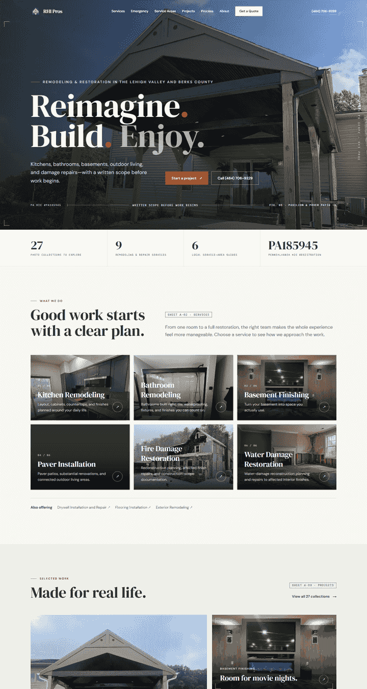
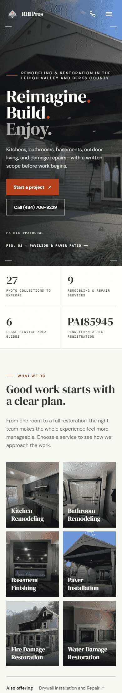

# "Drawn to scope" redesign and site polish — October 6, 2026

Branch `site-polish-2026-10-06`, based on `main` at `342d156` (tag `backup/pre-polish-2026-10-06`). Not pushed or deployed.

## Concept

RHI Pros' clearest differentiator is a **written scope before work begins**. The redesign turns that into a visual identity borrowed from architectural drawing sets, using only real business facts:

- **Sheet tags, figure numbers, dimension lines and crop marks** frame sections and photography (`A-01 … A-07`, `Fig. 01`, `Detail A`).
- **IBM Plex Mono annotations** (one preloaded weight) for drafting labels; DM Serif Display and DM Sans are unchanged.
- **Measuring-tape scroll indicator** at the top of every page (CSS scroll-driven animation; hidden where unsupported or with reduced motion).
- **Drafting / blueprint grids** behind the scope builder, inner-page heroes, dark sections and text-only service heroes.
- **Footer title block** with firm, PA HIC registration, service area, contact and revision year.

## New features

| Feature | Where | Notes |
| --- | --- | --- |
| **Scope Builder** | Homepage `#scope-builder`; linked from the quote page and closing CTA | Choose a space, tick items from that service's `whatIncluded`, pick timing, add notes. The sheet lists the service's `pricingFactors` and `qualityFactors`. No prices or estimates. **Send this to RHI Pros** opens a contact step inside the sheet (name, phone, email, city, ZIP) and submits directly to `/api/quote`, so the lead reaches the webhook/Discord, email and Manager App with the scope text in its details; the sheet then shows "Sent to RHI Pros". **Print or save as PDF** prints only the sheet. Events: `scope_builder_send` (contact step opened), `scope_builder_print`, plus the standard `quote_submit_attempt`, `quote_submit_error` and `generate_lead`. |
| **Service-area map** | Homepage "Close to home"; `/service-areas` | SVG positioned from real latitude/longitude; links to the four city hubs and two regions; US 222 and I-78 drawn as simplified corridors. Labeled "Schematic map · Approximate positions". Minor community labels hide on phones. |
| **"Straight answers" FAQ** | Homepage, with FAQPage JSON-LD | Six answers built only from facts already stated on the site (service area, written proposal, HIC, `insuranceClaimsClarification`, collection count, financing disclosure). |

## Accessibility (verified locally with axe-core 4.11)

- `--brand` changed from `#c7491f` (4.1–4.4:1 on light surfaces) to `#b4411b` (≥4.86:1 on every light surface; white text on it 5.66:1). `--brand-bright` keeps the vivid accent for decoration on dark photography only.
- Star ratings: `role="img"` with label, decorative SVGs hidden, gold raised to 3:1.
- Emergency bar wrapped in labeled `<aside>` landmarks; nested in-content `<aside>`s changed to `
`.
- Larger tap targets in the emergency bar, footer, review links and profile links.
- Headings that ran words together at line breaks ("worthcoming", "Remodeling,made", "outlookon") now include spaces.
- **Result:** 0 violations across 38 page views (19 pages × desktop and mobile), versus 5–23 serious contrast violations per page before.

## Performance

29 `-preview.webp` images were served `unoptimized`, so every device downloaded the 1600px file. They now go through `next/image`, getting responsive widths. `framer-motion` was used only for the mobile menu; it is replaced with CSS animations and removed from dependencies.

Throttled phone (390×844, 1.6 Mbps, 150 ms RTT, 4× CPU). "Before" is the live site running `main`; "after" is the local production build, so network distance differs slightly, but transfer sizes compare directly.

| Page | Transfer before → after | LCP before → after | CLS after |
| --- | --- | --- | --- |
| `/` | 2,673 KB → 415 KB | 1.80 s → 1.45 s | 0 |
| `/projects` | 4,315 KB → 818 KB | 5.76 s → 1.27 s | 0 |
| `/services/kitchen-remodeling` | 318 KB → 147 KB | 3.13 s → 1.26 s | 0 |
| `/request-a-quote` | 69 KB → 69 KB | 1.59 s → 1.11 s | 0 |

## SEO

- Homepage, `/services`, `/projects`, `/service-areas` and `/request-a-quote` H1s now include their descriptive eyebrow (for example "Remodeling & restoration in the Lehigh Valley and Berks County"), with no visual change to the display slogan.
- The six city-hub descriptions were one template promising "reliable scheduling"; each is now unique, built from that location's own `priorityAreas`. Two local descriptions were adjusted ("schedule control" promise removed; one shortened to ≤160 characters). Services and quote descriptions shortened.
- `robots.txt` disallows `/api/`. Noindex landing pages stay crawlable so their noindex remains visible.
- Business schema: typed `areaServed` (City / AdministrativeArea / Place) and a `hasOfferCatalog` of the nine primary services. Still no address, rating or review schema, per existing guardrails. WebSite schema gains `publisher` and `inLanguage`.
- Footer links to five core services, project photos and all six local hubs; new 404 page with service paths.

## Validation

| Check | Result |
| --- | --- |
| ESLint, TypeScript | Passed |
| `check:seo` | 0 errors; existing intentional warning for text-only water planning page |
| `check:quote` / `check:portfolio` / `check:lead-delivery` / `check:evidence` | 24 / 8 / 27 / 9 passed |
| Production build | Passed, 129 pages |
| `check:rendered-seo` | 120 sitemap routes, 29 project pages, 120 internal targets, 0 errors ([output](rendered-site-polish-2026-10-06.json)) |
| `check:images` | 131 pages, 193 decoded rasters, 80 delivered URLs, 0 errors ([output](images-site-polish-2026-10-06.json)) |
| Browser review | Desktop 1440 and mobile 390: no horizontal overflow, one H1 per page, mobile menu focus trap / Escape / scroll lock verified |
| Scope Builder → quote form | Service, details and timing carried over and cleared after use; submit returned the expected 503 phone fallback because no delivery channel is configured locally. **No lead was delivered.** |

## Follow-up review (same day)

A line-by-line review of the full diff and a cross-feature integration run found and fixed:

- **Printing:** the print stylesheet hid every `header`, including the scope sheet's own title, and hidden page content still produced blank trailing pages. The sheet is now cloned into a print-only root; printing yields a single page, and normal page printing is restored afterwards.
- **Map keyboard focus:** SVG links now show a visible focus ring and underline.
- **Discord delivery:** lead embeds are capped at Discord's 4,096-character limit so long details cannot fail webhook delivery.
- **Design noise:** removed the homepage stats band and "Sheet A-0x" section tags; increased spacing and contrast for service-card numbers.

An integration suite (30 checks, local build only) covers the scroll indicator, FAQ keyboard use, map focus and navigation, Scope Builder keyboard use, print isolation and cleanup, quote-form handoff, submit fallback without delivery, mobile menu, sticky CTA, emergency bars, the quote page's builder link, the 404 page, footer link resolution and console errors: **30/30 passed**.

## Scope Builder sends directly (October 7)

The first version's "Send this to RHI Pros" only opened the quote page with the scope pre-filled and asked for contact details again, so it did not appear to send. It now collects contact details in the sheet and submits through `/api/quote`. Verified against local stand-ins for all three channels (a strict Discord webhook stand-in enforcing Discord's message limits, an SMTP sink and a Manager App intake): 29/29 checks, including empty-field validation with no request sent, delivery of the full scope to Discord, email and Manager App, one `generate_lead` conversion per send, an undecided sheet sent as "Exploring options", and successful delivery by email and Manager App during a simulated Discord outage. No real lead was sent.

## Lead handling upgrades (October 7)

Branch `lead-handling-2026-10-07`:

1. **Customer confirmation email** after a delivered lead (service, timing, location and photo count only; no free text, so the form cannot relay arbitrary content). Opt out with `CUSTOMER_CONFIRMATION_EMAIL=off`.
2. **Project photos** (up to 4) on the quote form and Scope Builder, resized on the device; a 10 MB, 12-megapixel worst case produced a 0.99 MB request. Attached to Discord and the lead email; non-images are rejected.
3. **Cloudflare Turnstile** verified server-side when keys are configured; missing or failed checks are refused with a visible message, details kept and a fresh check issued; a Cloudflare outage does not lose the lead.
4. **Discord message** rebuilt with labeled fields, "via Quote form / via Scope Builder", the first photo inline, and mentions disabled. Discord does not make phone numbers tappable, so the number is shown as a plain field.

Verification: lead-delivery unit suite 36/36 (9 new tests); browser end-to-end against local channel stand-ins and Cloudflare's official test keys 24/24, plus 5/5 Turnstile-rejection checks and 3/3 photo-picker keyboard-focus checks; integration 28/28; rendered SEO and image audits 0 errors; accessibility 0 violations on the new steps (desktop and mobile).

## Not verified here

Real lead receipt, indexing, rankings, rich-result eligibility, Core Web Vitals field data and conversion impact need the live domain, Search Console and analytics after deployment. The new `scope_builder_*` events need a GTM trigger if they should appear as GA4 events.
