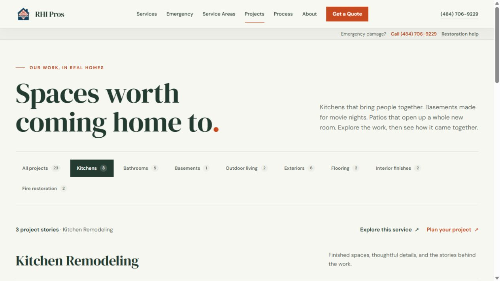
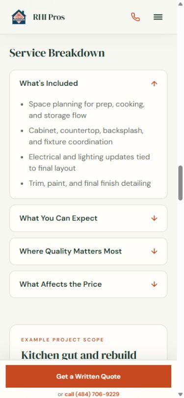

# RHI Pros customer-experience improvements

Completed locally on September 30, 2026, following the [trust cleanup](trust-cleanup-2026-09-30.md). The established visual design and existing editorial project order are preserved. Changes are uncommitted and have not been deployed.

## Improvements

- **Service navigation:** shared, responsive “On this page” links on service and local-service templates lead to the sections actually present: scope and cost, local planning, preparation, photos, questions, and the quote form. Anchor targets clear the sticky header.
- **Useful planning information:** service breakdowns now appear on every standard service detail page. Previously, the seven services with example scopes hid their existing inclusions, outcomes, quality factors, and pricing factors. The first disclosure opens by default; examples remain expressly hypothetical.
- **Project browsing:** filter counts come from published gallery records. The page shows its current result count and offers matching service/quote links. Empty results provide useful next steps with service preselection, and appear only when both curated stories and app photos are absent. Planning and commercial collections keep their existing separation. The 23 gallery stories differ from the 24 indexed detail pages because the text-only water-damage case is intentionally excluded from the gallery.
- **Mobile layout:** filter labels stay in their own horizontally scrollable row. Screen-reader count labels are contained so they cannot expand the whole page horizontally. Added a consistent default keyboard-focus ring while allowing component-specific styling. The sticky quote button transfers focus to the form heading before it disappears, keeping keyboard users in the right place.
- **Quote form:** known service names and slugs resolve consistently; correcting a failed field clears its error without stealing focus. Accessible field names stay stable while errors and hints are descriptions. Step two shows the contact/service summary. Repeated clicks during a pending send are guarded, fields are temporarily disabled, and failures preserve details and provide a phone fallback. This is a client-side guard, not a new server idempotency guarantee.
- **Phone validation:** both browser contact validation and API validation now require 7–15 digits in addition to the existing allowed formatting and 25-character limit. Punctuation-only entries are rejected; the prior seven-digit local format remains accepted.
- **Mobile navigation and photo viewer:** one shared focus hook handles initial focus, Tab/Shift+Tab containment, Escape, background inert state, and restoration to a still-visible trigger. The menu closes when the viewport changes to desktop. The image viewer uses the body portal above navigation, supports short-screen scrolling, announces photo changes, and handles stale image indices.
- **Visible content before JavaScript:** FadeIn emits visible server HTML. Native reveal animation is optional for sections starting below the viewport and cancels on keyboard focus or a reduced-motion preference. Initial content no longer depends on hydration to become visible.
- **Image loading:** homepage project cards below the hero no longer preload their lead photo. The Projects page explicitly retains priority for its first featured photo. Expandable galleries reserve the actual aspect ratio of their selected original or preview, preventing photo loading from shifting section links off target. The generated dimensions map covers 189 local project assets, including 29 previews, and accounts for EXIF rotation. `npm run images:dimensions` refreshes it after adding photos. Original images, preview mappings, crops, and project placements are unchanged.
- **Portfolio filtering:** the app feed now applies its requested limit to matching service photos. It previously limited the newest rows first, then filtered them, which could hide older matching work. Filtered requests fetch 100-row pages with deterministic ordering until enough matches, the feed ends, or 1,000 eligible rows have been scanned. Publishing, photo-type, stage, job-tag, cache, and error-fallback rules remain intact.
- **Routing and checks:** enabled Next.js’s documented smooth-scroll handling for route changes, resolving the observed browser warning. See the [Next.js guidance](https://nextjs.org/docs/messages/missing-data-scroll-behavior). The rendered SEO check now also validates fragment-only links against their actual targets. Added portable regression scripts using the already installed TypeScript/Zod libraries.

## Verification

| Check                                                                           | Result                                                                                                                  |
| ------------------------------------------------------------------------------- | ----------------------------------------------------------------------------------------------------------------------- |
| Prettier 3.6.2, print width 120, all 23 source/config/script files in this pass | Passed                                                                                                                  |
| `npm run lint`                                                                  | Passed, no warnings                                                                                                     |
| `npm run typecheck`                                                             | Passed                                                                                                                  |
| `npm run check:quote`                                                           | 24 accepted/rejected browser/API phone cases passed; no delivery calls                                                  |
| `npm run check:portfolio`                                                       | 8 mock-database tests passed: older matches, publishing/stage/tag rules, errors, limits, and fallbacks                  |
| Static SEO guard                                                                | Passed, 0 errors and the 2 existing warnings for the text-only water case                                               |
| `npm run build`                                                                 | Passed; 124 generated pages                                                                                             |
| Production-page crawl                                                           | 115 sitemap routes, 24 project pages, 115 internal targets, 0 errors; [saved results](rendered-quality-2026-09-30.json) |
| Actual React rendering of FadeIn on the server                                  | Visible content with no initial opacity/visibility hiding                                                               |
| Gallery dimensions generator and coverage                                       | Idempotent; 189 metadata entries verified, all 101 static paths and 29 preview pairs covered                            |
| Git whitespace check                                                            | Passed with CRLF-aware settings                                                                                         |

The first sandboxed build could not download the existing Google Fonts. The network-enabled rerun completed successfully. `npm run check:seo` also encountered the sandbox’s npm registry restriction; the same checker passed using the already cached tsx executable. No dependencies or lockfiles were added or changed.

Browser checks covered desktop and 390×844 mobile layouts; invalid quote focus, error correction, service preselection, both form steps, stable field labels, and 16px mobile inputs; menu Tab/Shift+Tab/Escape and desktop resizing; lightbox arrow navigation, focus restoration, and background isolation; local-page anchor targets; and empty project results. In the final production check, all four kitchen gallery images loaded with their correct reserved dimensions, and the scope anchor settled at 96px below the top of the viewport without shifting. The sticky quote button focused the form heading, landed the form at 96px, and then hid as intended. Mobile page width is 375px within the 390px viewport, with the browser’s scrollbar accounting for the remainder. No horizontal page overflow remains on the checked pages. Production route navigation logged no warnings or errors in the checked tab.

No valid quote was sent, and no customer/remote portfolio data was changed. No-JS safety was checked through actual server markup, rather than by disabling JavaScript in the browser. Reduced-motion cancellation was reviewed in the implementation; an operating-system preference change was not exercised in the browser.

## Preview

## Files changed in this pass

- `package.json`
- `scripts/check-rendered-seo.mjs`
- `scripts/check-quote-validation.mjs` — new
- `scripts/check-portfolio.mjs` — new
- `scripts/generate-project-image-dimensions.mjs` — new
- `src/app/globals.css`
- `src/app/layout.tsx`
- `src/app/projects/page.tsx`
- `src/app/services/[service]/page.tsx`
- `src/app/[city]/[service]/page.tsx`
- `src/components/forms/QuoteForm.tsx`
- `src/components/layout/MobileNav.tsx`
- `src/components/layout/StickyCTA.tsx`
- `src/components/sections/ExpandableImageGrid.tsx`
- `src/components/sections/FaqList.tsx`
- `src/components/sections/PageJumpLinks.tsx` — new
- `src/components/sections/ProjectCard.tsx`
- `src/components/ui/FadeIn.tsx`
- `src/components/ui/ImageLightbox.tsx`
- `src/components/ui/useModalFocus.ts` — new
- `src/content/projectImageDimensions.ts` — new
- `src/lib/portfolio.ts`
- `src/lib/quoteSchema.ts`

This report, the rendered audit JSON, and both preview PNGs are the additional audit artifacts. Existing working changes were extended in place; no reset, checkout, commit, push, or deployment was performed.

## Remaining verification

Update: the subsequent [evidence-resolution pass](evidence-resolution-2026-09-30.md) fixes the quote-delivery acknowledgement defect described below and resolves the photo/review/claim publishing decisions. The following paragraphs record findings at the time of this earlier quality review, rather than current unfixed defects.

The subsequent read-only release review found no supported regressions in the recent changes, but confirmed a pre-existing quote-delivery defect in `src/app/api/quote/route.ts`: the handler returns HTTP 200 with `ok: true` even when every contact delivery channel fails or is unconfigured. Isolated execution of the actual route reproduced both cases using mocks; no real lead or delivery request was sent. Webhook/email results discard `delivered: false`, Manager App failures can return `forwarded: false`, and the response at line 281 is unconditional. Fix this before publishing and then verify successful delivery through a configured contact channel. The route was not changed by either improvement pass or this review.

The [previous trust report](trust-cleanup-2026-09-30.md) remains the record for mixed Allentown kitchen photos, reused exterior photos, fire-project relationships, review sourcing, and operational/local claims. This pass does not resolve those factual questions. The requested generated water-damage image is still unavailable on this Windows host and has not been added to any service or case study.

Live Supabase filtering was tested with mocks, not authenticated production data. Sparse filtered requests can require up to 10 database calls, and matches older than the newest 1,000 eligible assets remain outside the scan. If the feed grows past that size, prefer a reviewed server-side filter/index strategy.

Lead delivery, actual public reviews, production indexing, and deployment behavior still require their configured external services. Current changes can be reviewed at the local production preview while it is running: http://127.0.0.1:3108.
