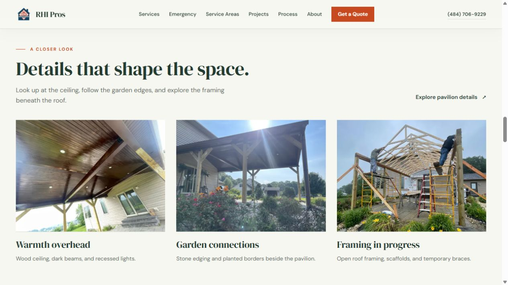
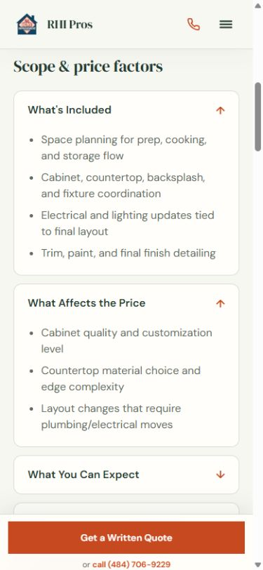
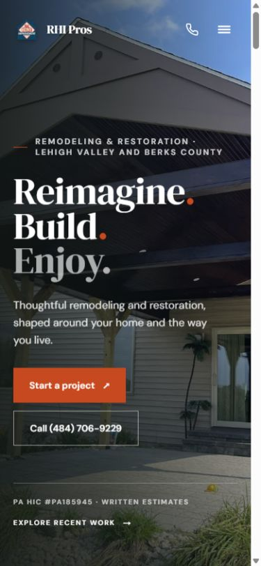

# Site refinements — October 1, 2026

Implemented the improvements supported by the existing photos, content and code after the latest site evaluation. The final production build passes. Photo history, ownership, locations and customer relationships have not been inferred from filenames or visual similarity.

## Automatic improvements

- The homepage and featured work now lead with the reviewed pavilion overview, followed by the basement media room and supporting kitchen collection. Responsive focal positions protect important details in hero and card crops.
- Added **Details that shape the space**, using existing ceiling, garden and framing photographs. The construction view is explicitly labeled **Framing in progress**, despite its misleading source filename. Captions describe visible features, without claiming a construction story or RHI ownership.
- Main and local service templates put scope and price factors before galleries and reviews, with early quote actions. Example scopes remain explicitly illustrative and retain all their text in expandable sections.
- Removed repeated featured photo cards when the same collection is already in the gallery. Kept its description, scope highlights, related links and all existing lightbox photos.
- Service galleries show two previews; project galleries show up to six main previews and four per additional group. The remaining images stay available through an accessible **more photos** button and viewer. No original photo or group was removed.
- The viewer supports horizontal pointer swipes, ignores vertical/canceled gestures, retains keyboard controls and focus restoration, prepares neighboring images, and provides loading/error/retry states. Navigation controls have a minimum 44px target.
- The service explorer retains the current photo and its matching caption until the requested image loads, rejects stale requests, transitions after image load, respects reduced motion and provides retry on failure.
- Restoration mobile bars now offer distinct call and quote choices, preserving service context. The normal quote action still focuses and scrolls to the on-page form; the bar hides when that form is visible.
- Our Process now identifies six short stages and the homeowner's decision at each stage. Hidden-condition documentation, cost/timing discussion and approval before additional work remain explicit.
- Removed bathroom campaign promises of “no surprises,” an unsupported form-duration claim and an assumed plumbing-layout answer. Replaced unsupported local frequency claims with condition-based planning guidance while preserving routes, headings and service targeting.
- Every project detail page now supplies its own Open Graph and Twitter title, description and representative image, where one exists. Text-only planning pages do not inherit unrelated project imagery. Added rendered metadata regression checks.
- Homepage headings and primary actions remain visible from the first animation frame. Shortened its entrance movement and shared below-fold reveals; reduced-motion handling remains intact.

## Validation

| Check                                               | Result                                                                                                           |
| --------------------------------------------------- | ---------------------------------------------------------------------------------------------------------------- |
| Formatting and whitespace                           | Passed for changed code                                                                                          |
| Full ESLint and typecheck                           | Passed                                                                                                           |
| Final production build                              | Passed; 124 generated pages                                                                                      |
| Quote, portfolio, lead-delivery and evidence checks | 52 passed; no real lead delivery                                                                                 |
| Static SEO guardrails                               | 0 errors; one intentional text-only water-planning warning                                                       |
| Rendered SEO crawl                                  | 115 sitemap routes, 24 project detail routes and 115 internal targets; 0 errors                                  |
| Image audit                                         | 126 page views, 192 source references, 192 fully decoded rasters and 79 delivered image URLs; 0 errors           |
| Template smoke checks                               | 69 service/local evaluations passed; existing available photo sets, price factors, anchors and metadata retained |
| Isolated interaction checks                         | 19 passed for loading/race/retry/gesture and reduced-motion behavior                                             |

The template and interaction smoke checks were isolated checks with UI/network dependencies stubbed. They supplement actual production-build checks; they do not prove external portfolio delivery or real contact delivery.

Audit data: [rendered SEO](rendered-refinements-2026-10-01.json) and [image delivery](image-refinements-2026-10-01.json). The final follow-up change affected only homepage animation CSS; the final build and immediate-visibility browser review passed after that change.

## Browser review

Reviewed desktop and 390×844 mobile views. The pavilion hero and detail images loaded correctly. No horizontal overflow was found in the reviewed homepage, service explorer, kitchen service, water service, process or Reading kitchen views. Temporary viewport settings were reset.

At the same mobile width, the main kitchen scope section now begins at about **953px**, compared with about **4,140px** in the earlier evaluation. The quote section moved from about **6,990px** to **4,531px**; total page height decreased from about **9,170px** to **6,710px**. The Reading kitchen page also places planning before photos and retains Kitchen Remodeling as the form selection.

All four explorer choices loaded matching images and captions. The documentation gallery's **21 more photos** action opened photo **7 of 27**. Next-button, ArrowLeft, horizontal drag, vertical drag and Escape behavior passed: horizontal navigation changed the photo, vertical movement preserved it, and Escape restored focus to the original button. Viewer controls measured 44px tall. Restoration call/quote controls measured 62.5px tall and the quote link retained the water service parameter. The ordinary quote control focused the form heading, scrolled it below the header and hid the sticky bar.

Horizontal dragging was tested through the browser's pointer interface; this is not a physical handset touch test. Loading failures and request races were covered by isolated component checks and code review, without deliberately disrupting production network requests.

## Project integrity and unresolved facts

- Evidence checks retained all **103 original photo assets** and **106 per-record unique references**, with unchanged file bytes. All 24 existing project detail routes remain.
- Mixed kitchen rooms retain separate customer-friendly design headings; they are not combined into one authenticated Allentown job.
- Overlapping exterior photographs retain their existing cross-reference and omitted duplicate showcase placement. Similar appearance does not prove a single contract.
- The 38 field-documentation photos remain in groups of 27, 8 and 3. No shared property, event chronology or completed rebuild is inferred.
- Blue kitchen installation protection and unfinished areas remain described accurately. Reordering them into supporting placements does not turn them into fully completed-job evidence.
- Water imagery remains a labeled AI-generated generic service illustration on the homepage and main/local water service pages. It does not appear in project or before/after evidence.
- No new testimonial, customer, crew biography, credential, insurer, certification, mitigation capacity, warranty guarantee or construction scope was invented.

Authentic team portraits/biographies and documented project stories still require actual records. Current HIC status, insurance coverage, written warranty/financing terms, specialist restoration capabilities and real lead receipt cannot be established through visual polish or this local build. Existing evidence-limited wording remains appropriate until primary records are available. Google Search Console performance changes require later data; this pass does not claim a ranking or click gain.

Publication uses the existing main-to-Vercel production pipeline under the user's established publishing instruction. The task's final reply records the live release result.

## Files modified

- `CODEX.md`; `scripts/check-rendered-seo.mjs`
- `src/app/page.tsx`; `src/app/globals.css`; `src/app/our-process/page.tsx`
- `src/app/projects/[slug]/page.tsx`; `src/app/services/[service]/page.tsx`; `src/app/[city]/[service]/page.tsx`
- `src/app/landing/bathroom-remodeling/page.tsx`
- `src/components/layout/StickyCTA.tsx`
- `src/components/sections/ExpandableImageGrid.tsx`; `ProcessTimeline.tsx`; `ProjectCard.tsx`; `ServiceExplorer.tsx`; `ServiceHero.tsx`
- `src/components/ui/FadeIn.tsx`; `ImageLightbox.tsx`
- `src/content/localSeo.ts`; `projectShowcase.ts`; `imageFocalPoints.ts` (new)
- This report, the two audit JSONs and three preview PNGs.

## Previews

